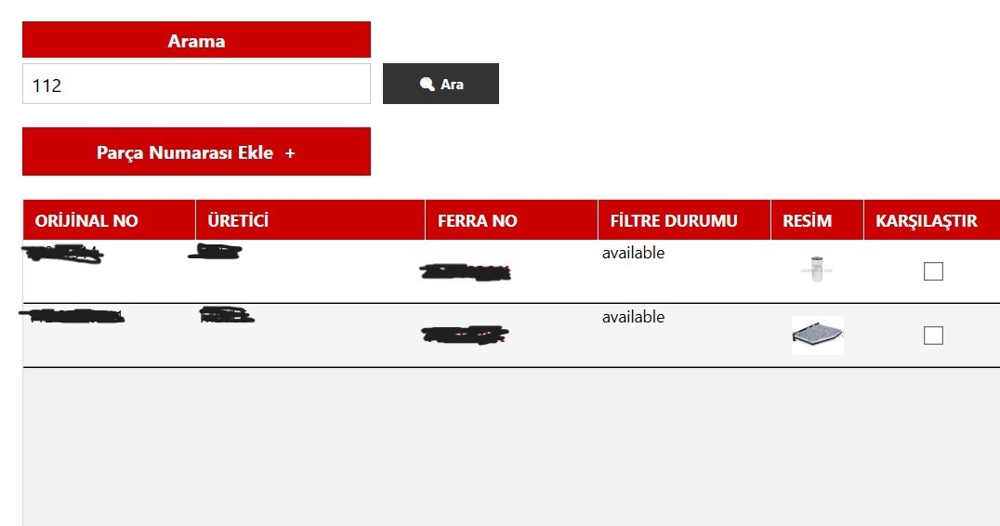
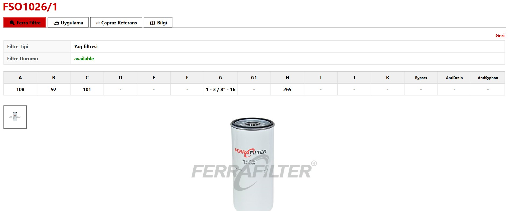
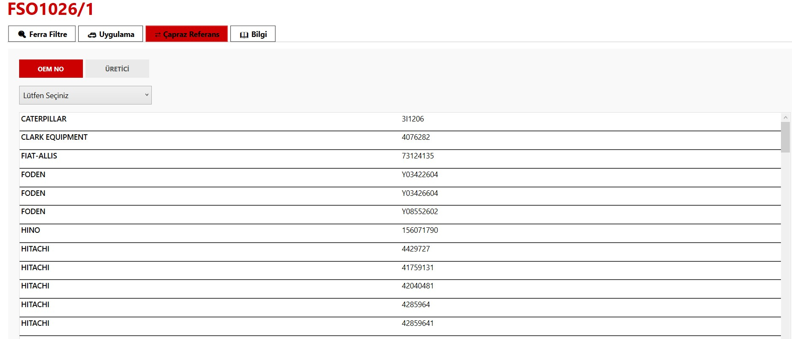

# 🏭 Offline Industrial Catalog & Cross-Reference System


A high-performance, offline-first desktop application built with **WPF, C#**, and **Dapper**. This system allows industrial users (like factory workers or warehouse managers) to search for product cross-references (OEM/Competitor numbers to Internal Brand numbers) and view detailed technical specifications instantly without requiring an internet connection.

---

## ⚠️ Data Privacy Disclaimer
*This repository contains the fully functional source code and architecture of the application. However, to comply with strict data privacy policies and protect client confidentiality, **all real commercial data, brand names, and product images have been replaced with mock (dummy) data.** The provided SQL script allows you to test the system locally.*

---

## 📸 Screenshots









---

## 🚀 Key Features

* **Lightning-Fast Queries:** Utilizes **Dapper** (Micro-ORM) for zero-latency SQL Server database reads, even with thousands of cross-reference records.
* **100% Offline Capability:** All product images are cached and read from a local directory relative to the executable (`/Fotograflar`). No AWS/S3 or internet latency.
* **Robust Cross-Reference Engine:** Search by competitor numbers to instantly find the equivalent internal product and its exact specifications.
* **Production-Ready Architecture:** Clean separation of concerns with Repository patterns and scalable Data Models.

---

## 🛠️ Tech Stack

* **Frontend:** WPF (Windows Presentation Foundation), XAML
* **Backend:** C# (.NET 8)
* **Database:** Microsoft SQL Server
* **ORM:** Dapper
* **Architecture:** Repository Pattern

---

## ⚙️ Setup & Installation

Follow these steps to run the application locally with the dummy dataset:

1. **Clone the Repository:**
   ```bash
   git clone [https://github.com/yourusername/your-repo-name.git](https://github.com/yourusername/your-repo-name.git)
2. **Database Preparation:**

Open Microsoft SQL Server Management Studio (SSMS) and create a new database named FerraFilterDB.

Open the Setup_DummyDatabase.sql file located in the project folder and execute it on this new database. This will create the required table structures and insert the mock data.

3. **Connection String Configuration:**

Open the project in Visual Studio.

Locate the App.config file (or FerraFilterApp.dll.config if using the compiled release).

Find the connection string and update the Data Source=... parameter with your local SQL Server instance name. Save the file.

4. **Build and Test:**

Double-click the FerraFilterApp.sln file to load the solution in Visual Studio.

Press F5 to build and launch the application.

Type one of the dummy competitor numbers (e.g., ACME-9901 or FAKE-13) into the search bar to verify the offline database connection and image rendering are working correctly.
